# Lab8 SQL Garden_Glory

Use Garden_Glory database to answer the following questions and show the results from the
SQL statements.

## Author

Chaiyapat Meeying 65070501073

A. Write an SQL statement to list LastName, FirstName, and CellPhone for all employees having an experience level of Master.

```sql
SELECT FirstName,LastName,Cellphone
FROM `employee`
WHERE ExperienceLevel = "Master";
```

Result:

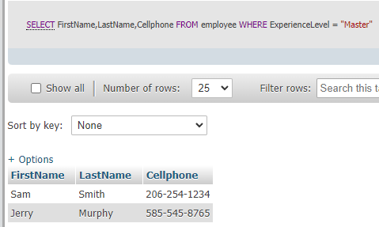

B. Write an SQL statement to list Name and CellPhone for all employees having an
experience level of Master and Name that begins with the letter J.

```sql
SELECT FirstName,Cellphone
FROM `employee`
WHERE ExperienceLevel = "Master"
AND FirstName LIKE "J%";
```

Result:

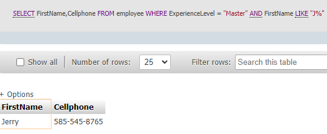

C. Write an SQL statement to list the names of employees who have worked on a property
in New York. Use a subquery.

first I'll try this but this doesn't has employee name

```sql
SELECT *
FROM `service`
WHERE propertyID IN
(SELECT propertyID
FROM `property`
WHERE city = 'NY');

```

this look great!

```sql
SELECT s.*,
(SELECT FirstName
FROM `employee`
WHERE EmployeeID = s.EmployeeID) AS owner_name
FROM `service` s
WHERE s.propertyID IN
(SELECT propertyID
FROM `property`
WHERE State = 'NY');
```

Result;

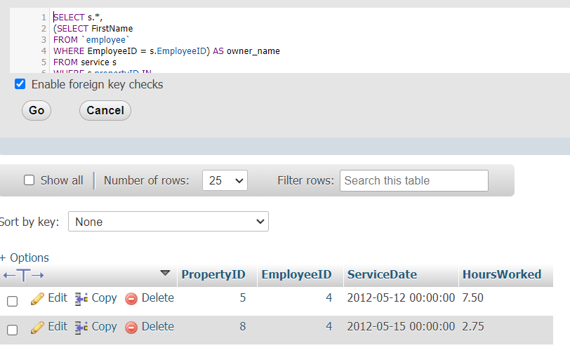

D. Answer question C but use a join.

```sql
SELECT e.FirstName
FROM `service` s
JOIN property p ON s.propertyID = p.propertyID
JOIN employee e ON s.EmployeeID = e.EmployeeID
WHERE p.State = 'NY';
```

Result:

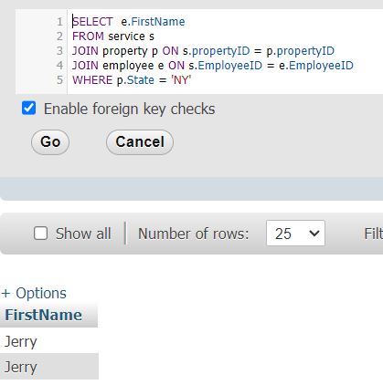

E. Write an SQL statement to list the names of employees who have worked on a property
owned by a Corporation. Use a subquery.

```sql
SELECT FirstName
FROM `employee`
WHERE EmployeeID IN
(
    SELECT employeeID
    FROM `service`
    WHERE propertyID IN(
        SELECT propertyID
        FROM `property`
        WHERE OwnerID IN(
            SELECT OwnerID
            FROM `owner`
            WHERE ownerType = 'Corporation'
        )
    )
)
```

Result:

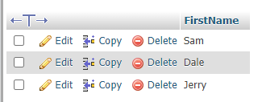

F. Answer question E but use a join.

```sql
SELECT DISTINCT e.FirstName, e.LastName
FROM `employee` e
JOIN `service` s ON e.EmployeeID = s.EmployeeID
JOIN `property` p ON s.PropertyID = p.PropertyID
JOIN owner o ON p.OwnerID = o.OwnerID
WHERE o.OwnerType = 'Corporation';
```

Result:

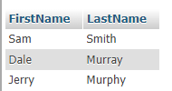

G. Write an SQL statement to show the name and sum of hours worked for each employee.

```sql
SELECT e.FirstName,SUM(s.HoursWorked) as "workHours"
FROM service s
JOIN employee e ON s.EmployeeID = e.EmployeeID
GROUP BY s.EmployeeID
```

Result:

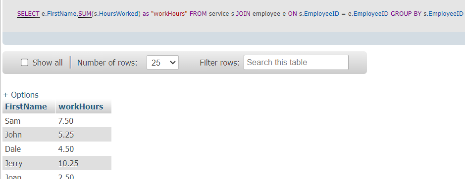

H. Write an SQL statement to show the sum of hours worked for each ExperienceLevel of
EMPLOYEE. Sort the results by ExperienceLevel in descending order.

```sql
SELECT e.ExperienceLevel,SUM(s.HoursWorked) as "workHours"
FROM service s
JOIN employee e ON s.EmployeeID = e.EmployeeID
GROUP BY e.ExperienceLevel
ORDER BY e.ExperienceLevel DESC
```

Result:

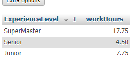

I. Write an SQL statement to show the sum of HoursWorked for each Type of OWNER but
exclude services of employees who have ExperienceLevel of Junior and exclude any  
type with less than three members.

```sql
SELECT o.OwnerType ,SUM(s.HoursWorked) as "workHours"
FROM `owner` o
JOIN `property` p ON o.OwnerID = p.OwnerID
JOIN `service` s ON s.PropertyID = p.PropertyID
JOIN `employee` e ON e.EmployeeID = s.EmployeeID
WHERE e.ExperienceLevel != 'Junior'
GROUP BY o.OwnerType
HAVING COUNT(o.OwnerID) >= 3;
```

Result:

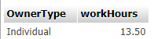

J. Write an SQL statement to insert yourself as an employee where your experience level
is Novice and EmployeeID is your studentID.

```sql
INSERT INTO `employee`
(`EmployeeID`, `LastName`, `FirstName`, `CellPhone`, `ExperienceLevel`)
VALUES ('1073', 'Meeying', 'Chaiyapat', '012345', 'Novice');
```

Result:

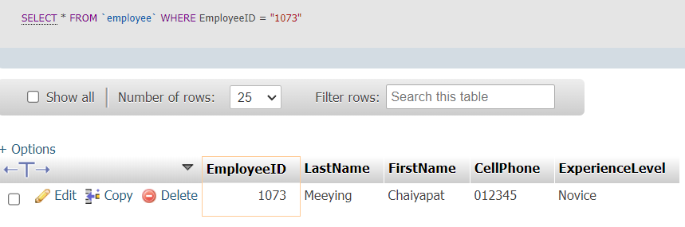

K. Write an SQL statement to modify all EMPLOYEE rows with ExperienceLevel of Master
to SuperMaster.

```sql
UPDATE `employee`
SET `ExperienceLevel` =
    CASE
        WHEN `ExperienceLevel` = 'Master' THEN 'SuperMaster'
        ELSE `ExperienceLevel`
    END;
```

Result:

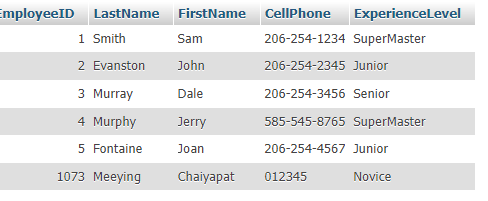

L. Write an SQL statement to switch the values of ExperienceLevel so that all rows
currently having the value Junior will have the value Senior, and all rows currently having
the value Senior will have the value Junior.

```sql
UPDATE `employee`
SET `ExperienceLevel` =
    CASE
        WHEN `ExperienceLevel` = 'Junior' THEN 'Senior'
        WHEN `ExperienceLevel` = 'Senior' THEN 'Junior'
        ELSE `ExperienceLevel`
    END;
```

Result:

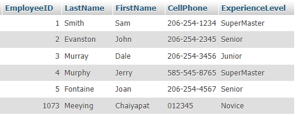

M. Delete yourself from Employee

```sql
DELETE FROM `employee`
WHERE `EmployeeID` = 1073;
```

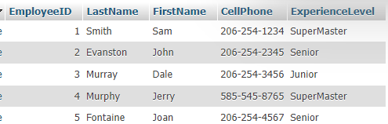
